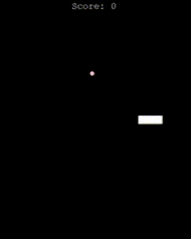

# 🐍 Classic Snake Game in Python

A simple implementation of the classic Snake game using Python's built-in Turtle graphics library. 

## 🎮 Game Features

- Arrow key controls  
- Snake grows when eating food  
- Collision detection (self and wall)  
- Score tracking  

## 🖼️ Preview



## 🛠️ Requirements

- Python 3.x  
- Turtle module (included with Python's standard library)  

## 🚀 Getting Started

1. Clone the repository:
   ```bash
   git clone https://github.com/yourusername/snake-game-python.git
   cd snake-game-python
   ```
2. Run the game:
   ```bash
   python snake.py
   ```

## 🎮 Controls

- ⬆️ **Up Arrow** – Move up  
- ⬇️ **Down Arrow** – Move down  
- ⬅️ **Left Arrow** – Move left  
- ➡️ **Right Arrow** – Move right  

## 📁 File Structure

```
snake/
├── snake.py         # Main game logic
├── README.md        # This file
├── images/
│   └── demo.gif     # Gameplay demo
```

## 📜 License

This project is licensed under the [MIT License](LICENSE).

## 👤 Author

- **Cory** – [@ctrlaltwilso](https://github.com/ctrlaltwilso)

---

Feel free to contribute, fork, or customize!
